# 声愈项目 App 运行流程图

## 一、系统架构总览

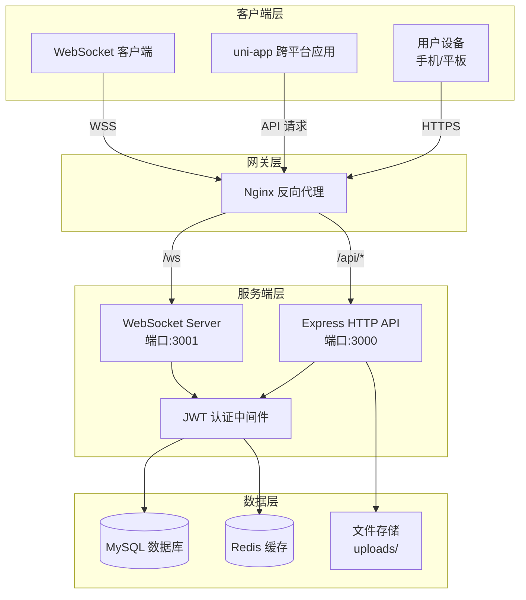

## 二、用户注册/登录流程

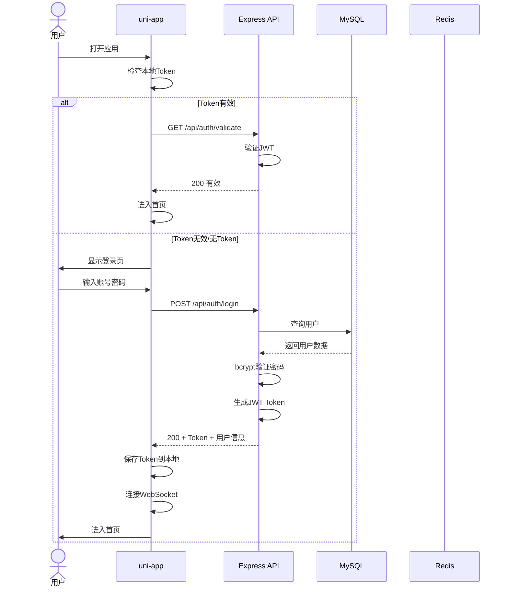

## 三、首页声音浏览流程

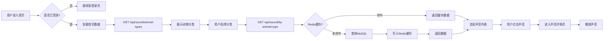

## 四、录音与发布流程

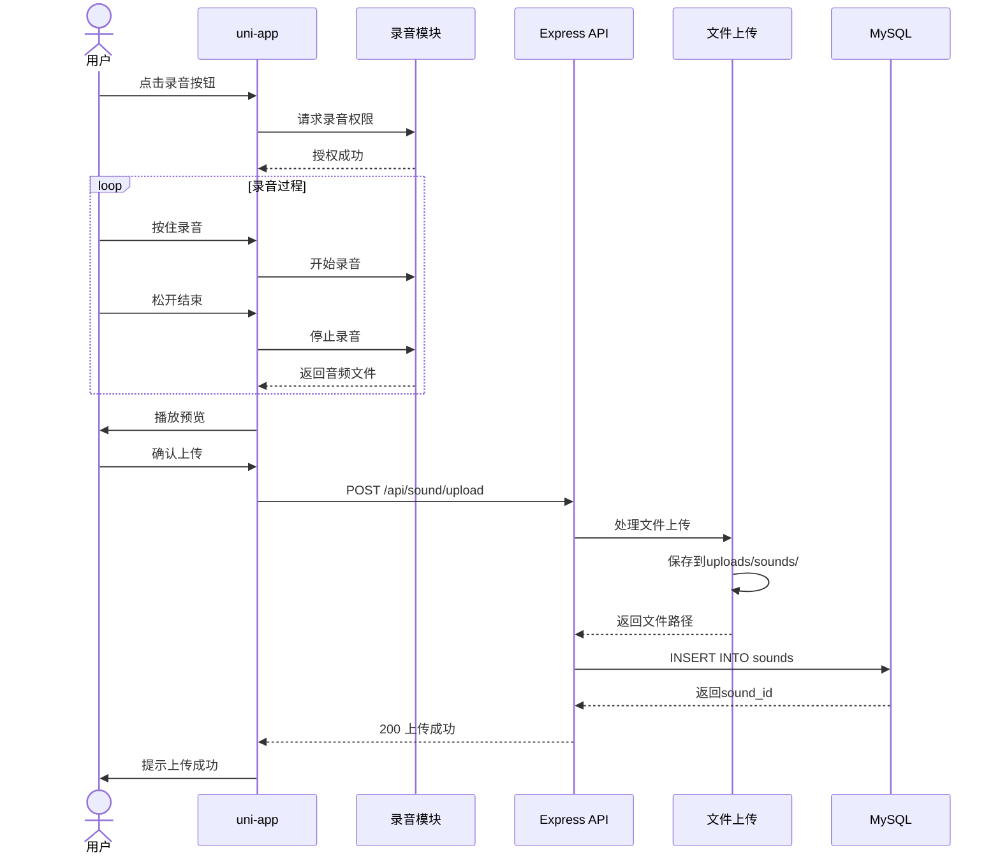

## 五、社区帖子浏览与互动流程

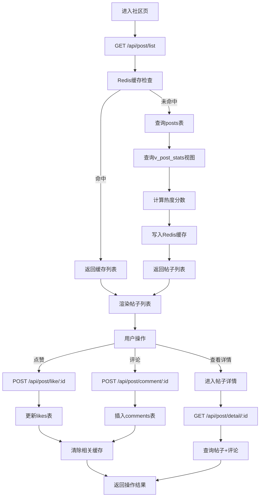

## 六、实时私信流程

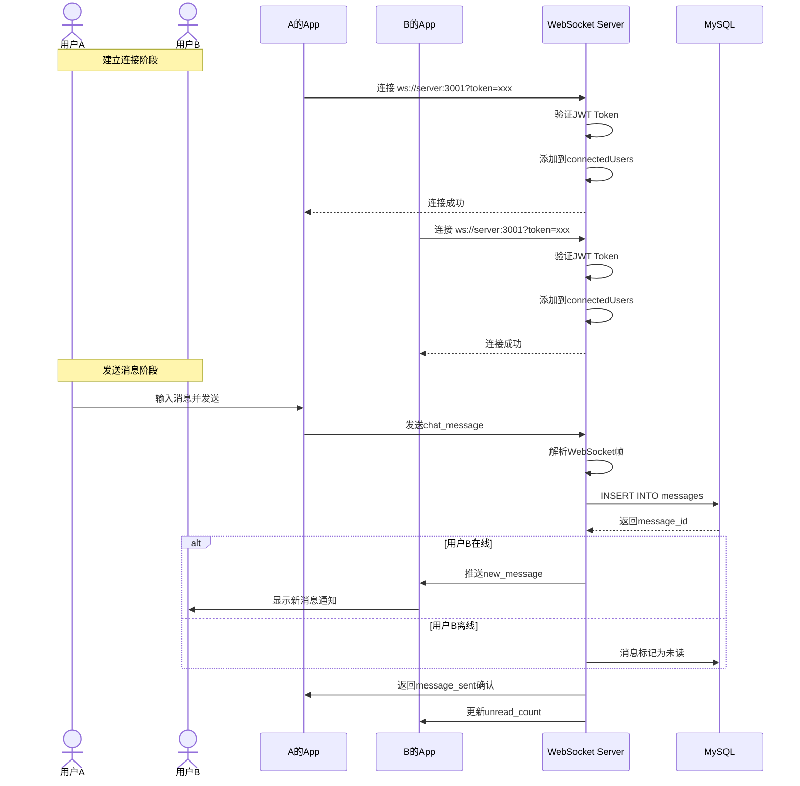

## 七、关注与粉丝系统流程

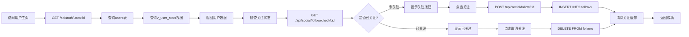

## 八、热门推荐算法流程

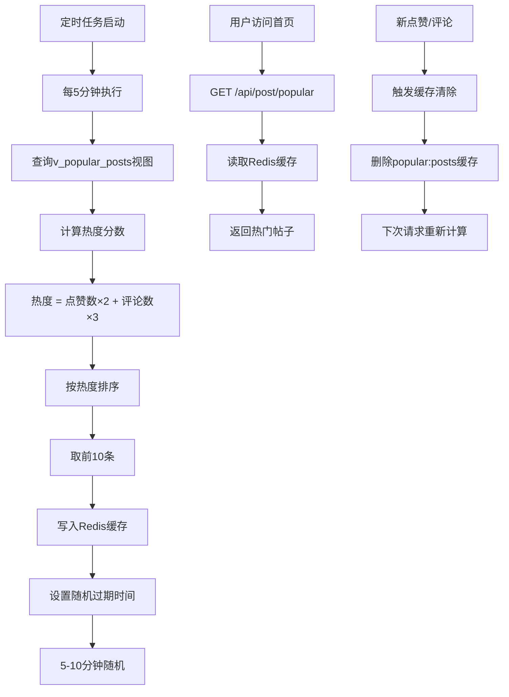

## 九、文件上传处理流程

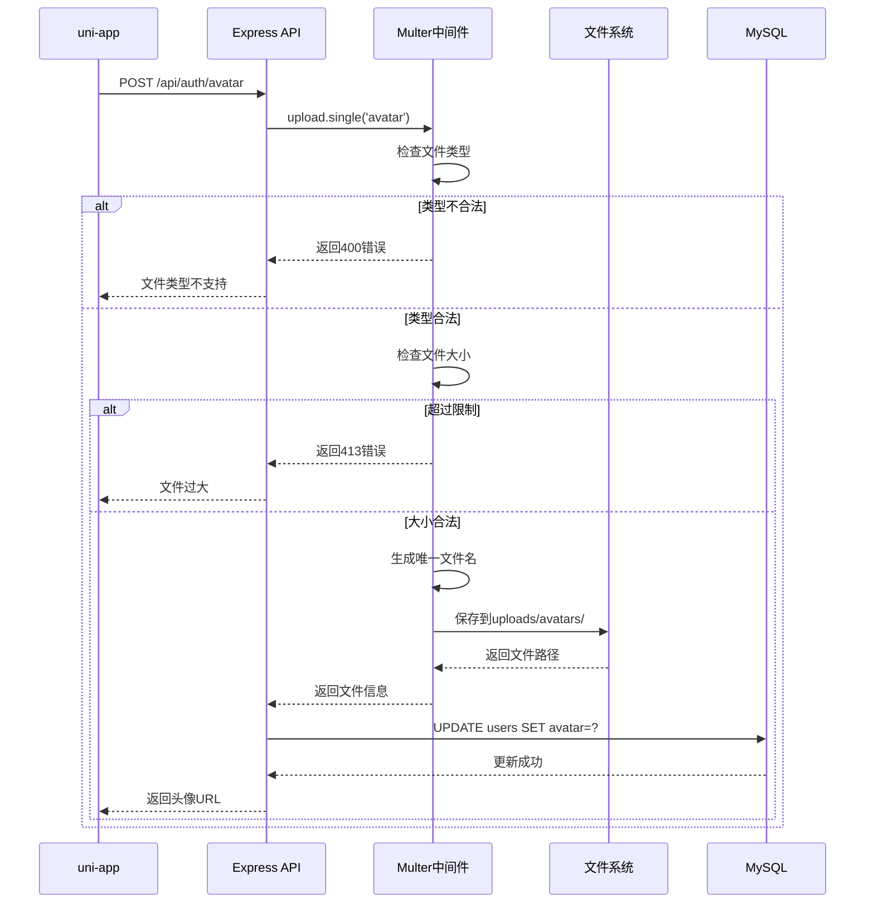

## 十、缓存策略流程

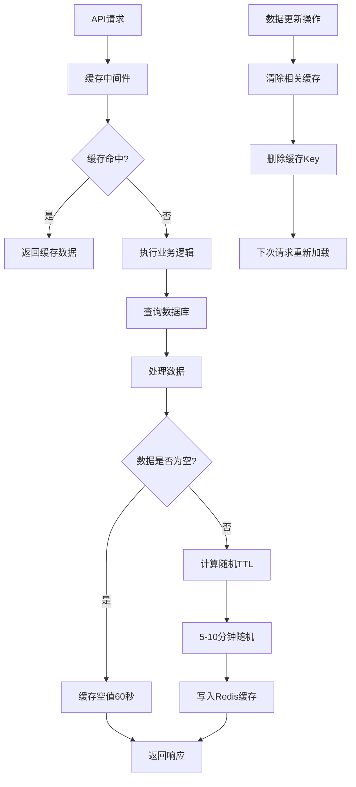

## 十一、页面路由结构

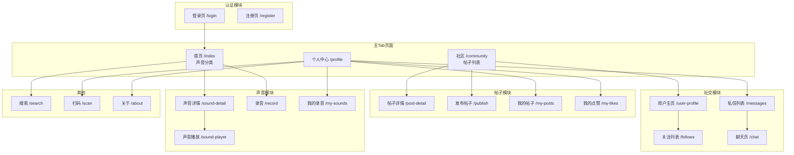

## 十二、数据流图

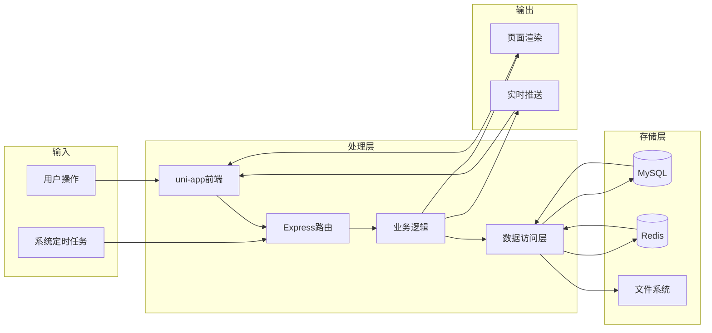

## 十三、错误处理流程

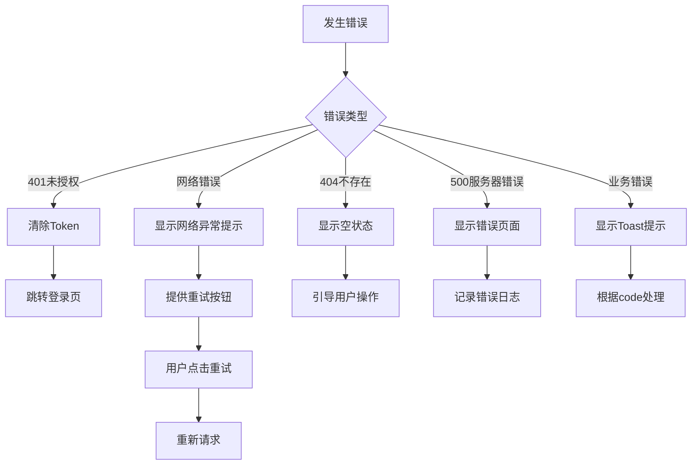

---

**文档版本**: v1.0  
**更新日期**: 2026-04-23  
**说明**: 本文档使用 Mermaid 语法绘制，可在支持 Mermaid 的编辑器中渲染查看
